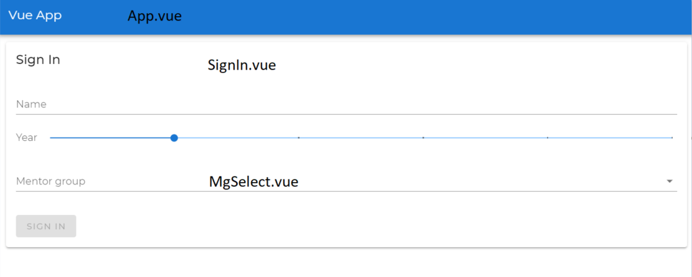

# Frontend

## Running the project
1. Install dependencies
    ```
    npm install
    ```
2. Compile and serve Vue
    ```
    npm run serve
    ```
   You should see something like this:
   ```
   App running at:
   - Local:   http://localhost:8080/
   - Network: http://192.168.1.5:8080/
    ```
   Open either of the URLs in a browser to access the app.
   Changes that you make should be automatically reflected.

### Project structure
- `.eslintrc.js`: Configures [eslint](https://eslint.org/) to enforce code formatting
- `tsconfig.js`: Configures TypeScript compile options
- `package.json`: Specifies project dependencies.
- `public`: Static assets (fonts)
- `src`: Main project logic and views (almost all editing done here)
    - `main.ts`: Loads libraries and initializes Vue instance
    - `App.vue`: Root component, the parent of all the other components
    - `plugins`: Configuration for libraries
    - `views`: Components referenced by vue-router (pages)
    - `components`: Components used by other components and not referenced by router
    - `types`: Type declarations
    

- `App.vue`: Root
- `SignIn.vue`: Page/View
- `MgSelect.vue`: Component

### Libraries
- [Vue](https://vuejs.org/)
- [Vue router](https://router.vuejs.org/): Handles navigation
- [Vuetify](https://vuetifyjs.com/en/): Material Design UI components library
- [Vuex](https://vuex.vuejs.org/): Global state management

### Deployment
To create an optimized build, run
```
npm run build
```
Output files will be in `dist`

